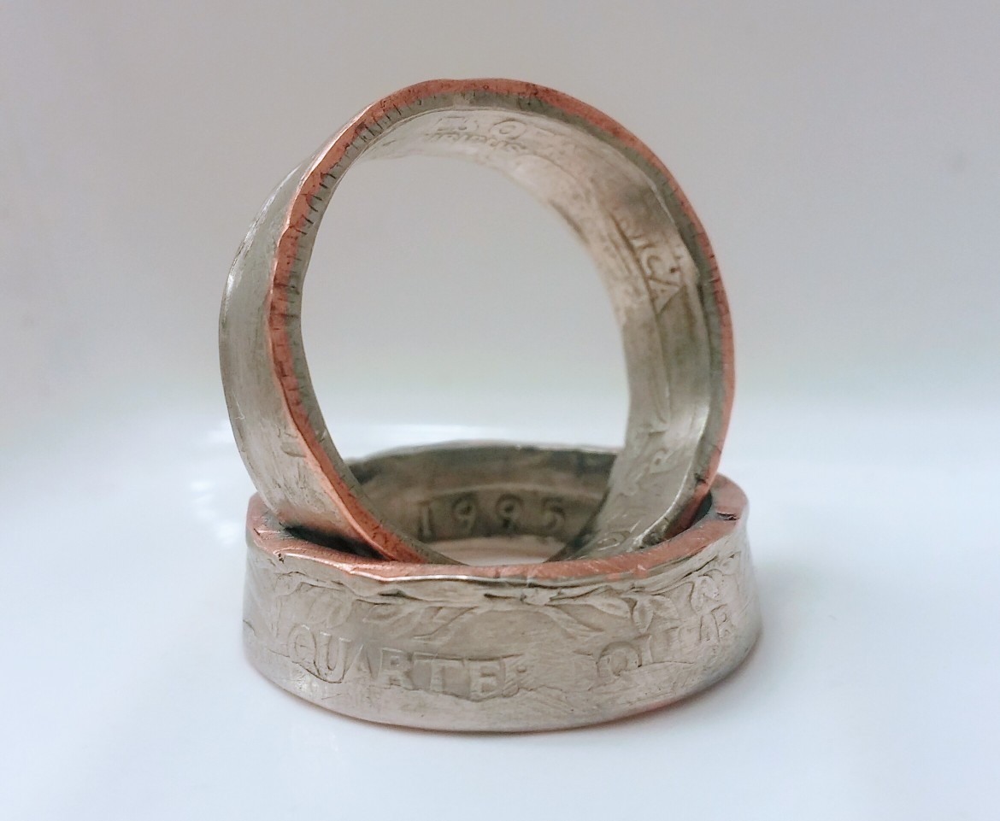
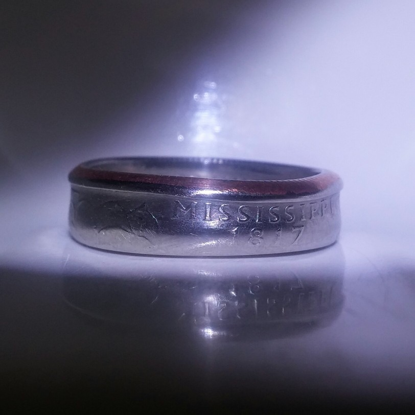
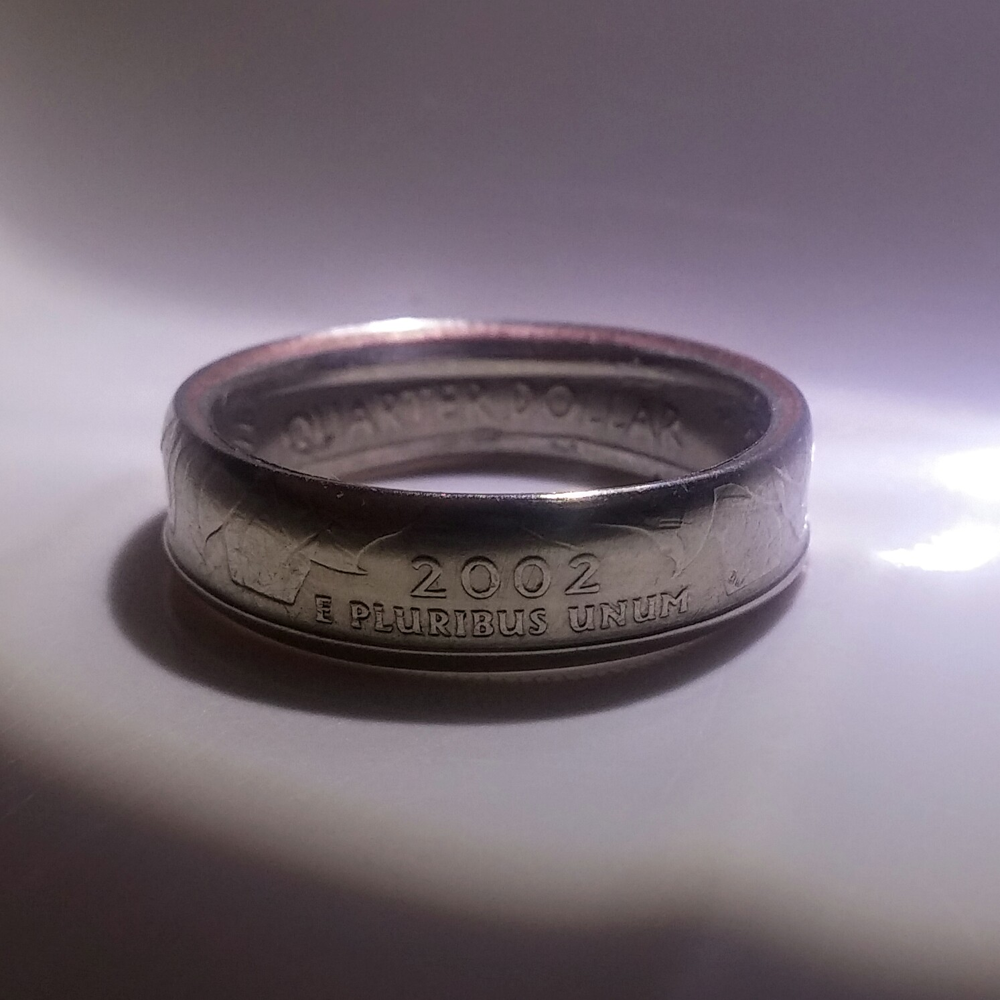
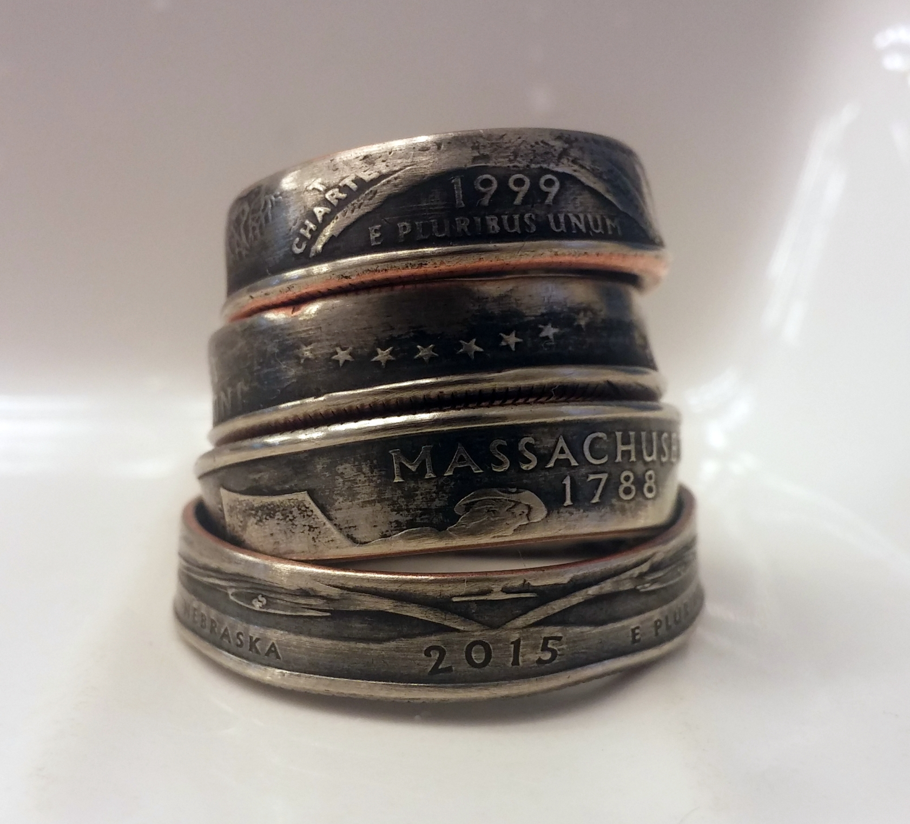
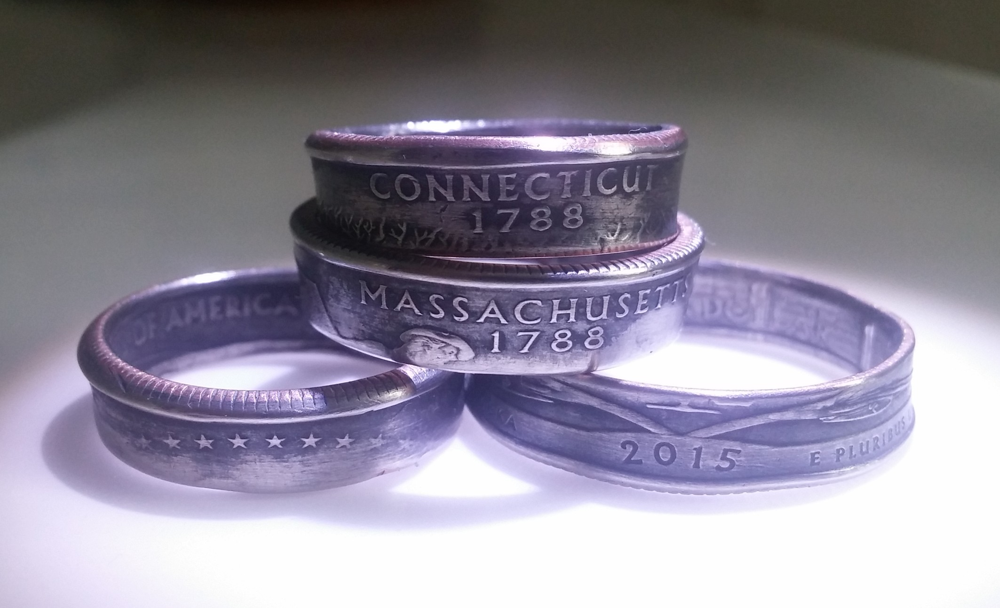
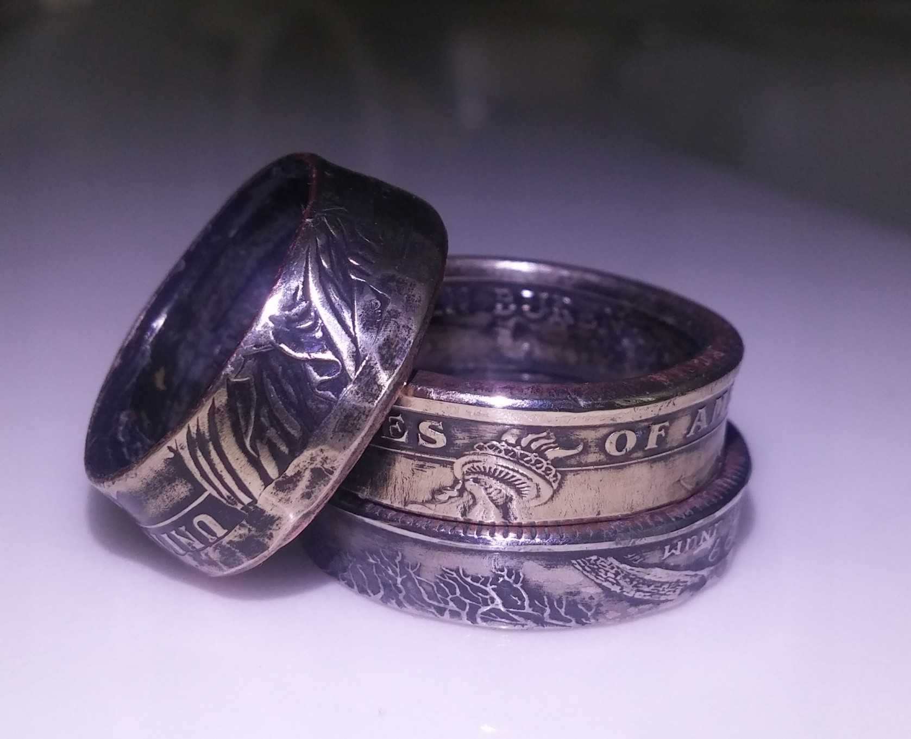
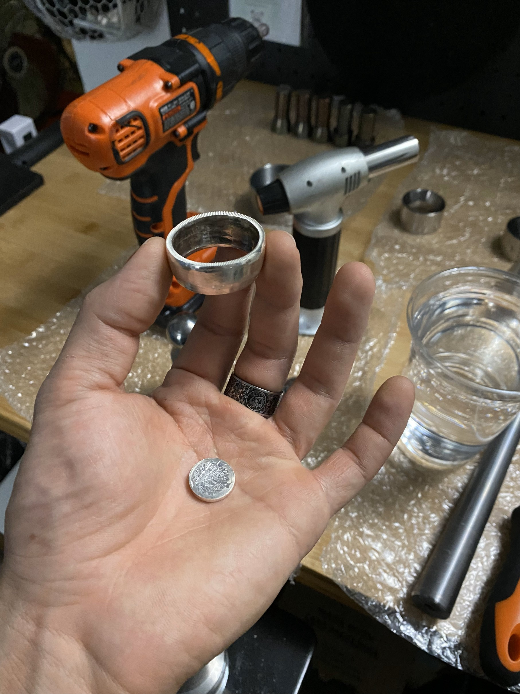
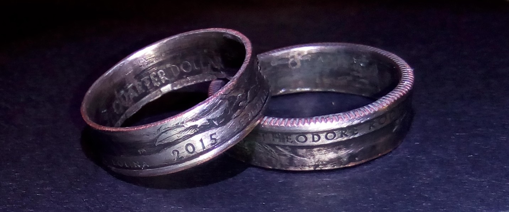
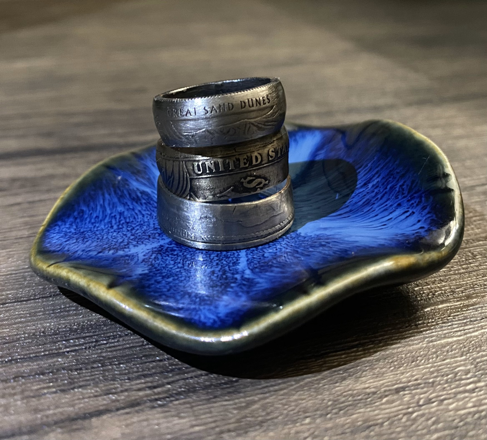
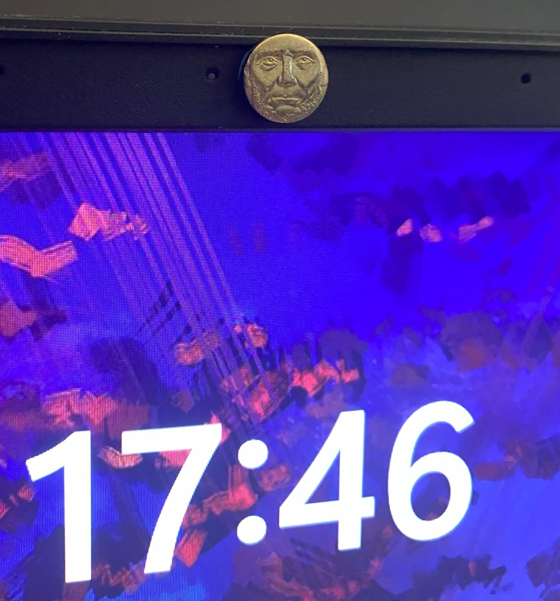

An occasional hobby of mine is creating rings from coins. I punch out the center of the coin, then de-burr and sand the hole. I anneal it with a torch, pound it into a reduction die to fold and reduce it, then stretch to finger size with a ring stretcher. (Repeat these steps as needed.) Finally I add patina by soaking it in acid for a few minutes, sand off the highlights, then seal with clear coat and polish.

I got a lot of practice when I was cashier and had regular access to coins and would make them for all the other cashiers. I specialize in US quarters because they are easily obtainable and work well with my equipment.

