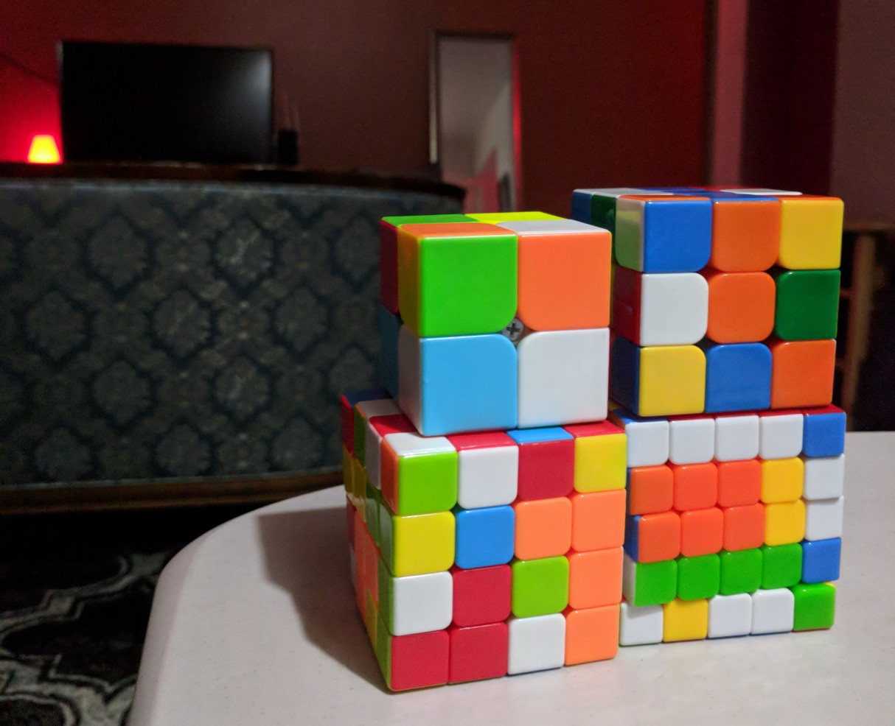

I finally sat down with the 3x3 algorithms in high school after years of aspiration and the rest quickly followed.

Each odd-numbered cube is much the same as the last but with an extra reducer algorithm to build the edges. As opposed to the parity problems of even-numbered cubes which adds way more steps.

