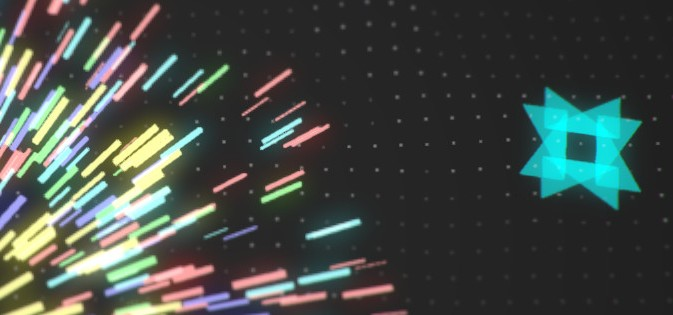

Concepts from one of my unmade games, *Neon Garden*.

<figure aria-label="An explosion of colorful particles">
	<video controls autoplay loop muted playsinline>
		<source src="/neon-garden/particles.mp4" type="video/mp4" />
	</video>
	<figcaption>Simple neon particle effects</figcaption>
</figure>

<figure aria-label={`A "black hole"-like gravity well with swirling particles`}>
	<video controls autoplay loop muted playsinline>
		<source src="/neon-garden/gravity-well.mp4" type="video/mp4" />
	</video>
	<figcaption>Gravity well with particle physics. The spiral arms are basically world-space particle rays being spun around and then pulled back into orbit before decaying. The colors are fixed saturation/brightness with the hue cycling on a sine function.</figcaption>
</figure>

<figure aria-label="A star-shaped apparatus absorbing golden orbs">
	<video controls autoplay loop muted playsinline>
		<source src="/neon-garden/collectibles.mp4" type="video/mp4" />
	</video>
	<figcaption>Simple collectibles</figcaption>
</figure>

<figure aria-label="A visual reticle placed over an icon, activating a particle effect">
	<video controls autoplay loop muted playsinline>
		<source src="/neon-garden/debug-trigger-reticle.mp4" type="video/mp4" />
	</video>
	<figcaption>A debug trigger and reticle</figcaption>
</figure>

<figure aria-label="A web of interconnected orbs spreading randomly across a grid">
	<video controls autoplay loop muted playsinline>
		<source src="/neon-garden/node-graph-virus.mp4" type="video/mp4" />
	</video>
	<figcaption>A recursive branching node graph effect. Like a slime mold in a maze, the routine can scale any area and avoid obstacles.</figcaption>
</figure>

<figure aria-label="An eight-pointed flower-like shape blooming and then recoiling">
	<video controls autoplay loop muted playsinline>
		<source src="/neon-garden/procedural-mesh.mp4" type="video/mp4" />
	</video>
	<figcaption>Procedural mesh animation. This demonstrates the core idea of the project which was to dynamically compose intricate designs from a base geometric shape. Each segment is simply a rectangle with the drawing order of two vertices swapped while an additive blending shader does the magic.</figcaption>
</figure>