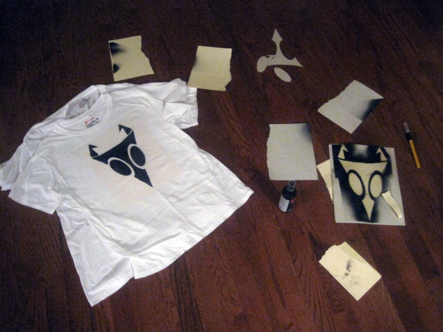
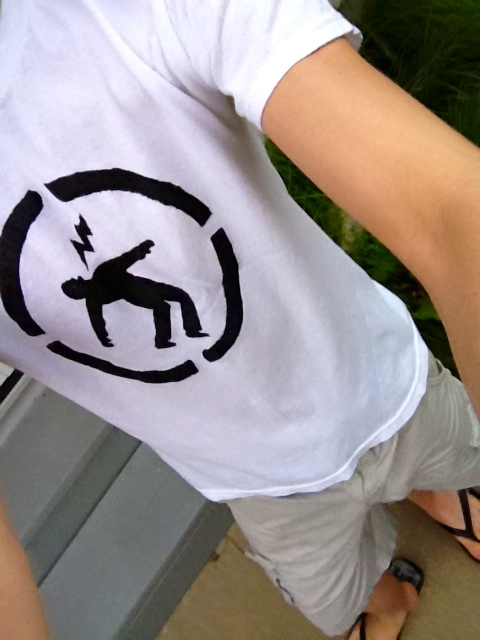
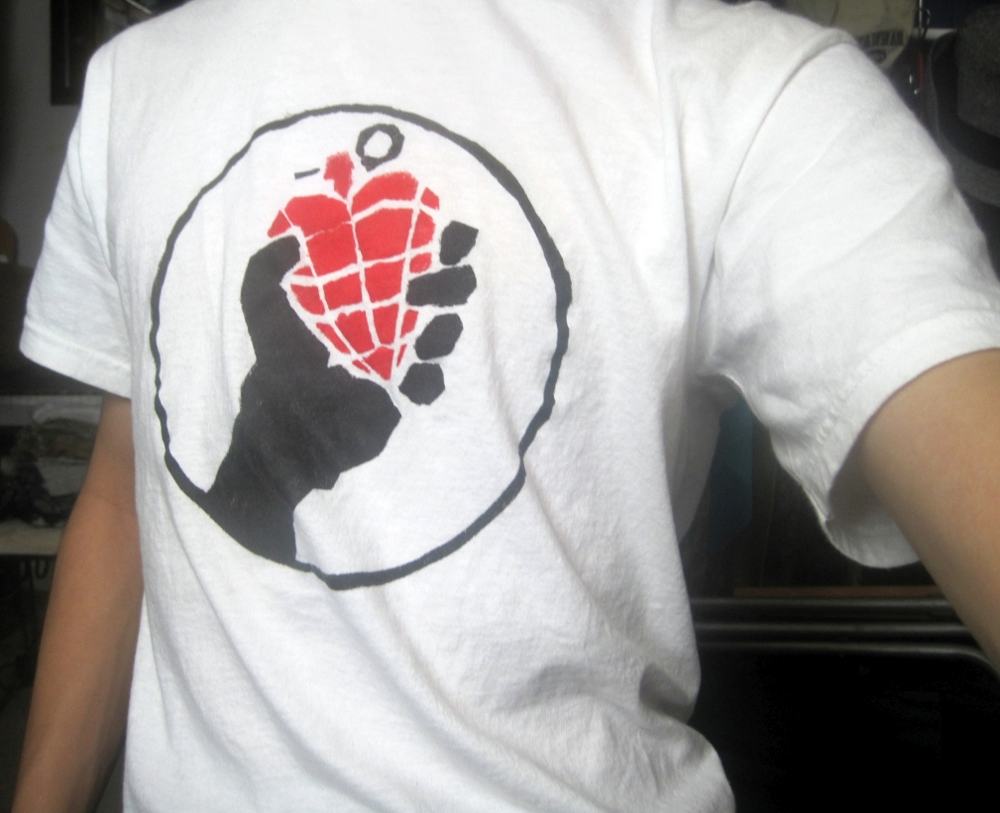

One hobby I tried out in middle school was t-shirt painting. I would print and cut out stencils with a utility knife, then spray or brush the shirt with fabric paint. Really basic home craft. I only ever ended up doing a few.

Nowadays I would never wear something so tacky.

