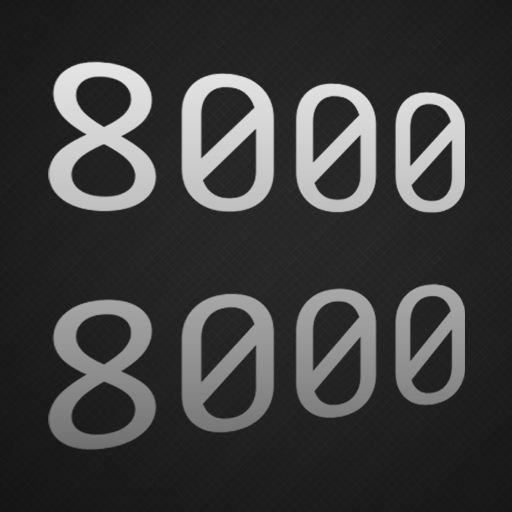
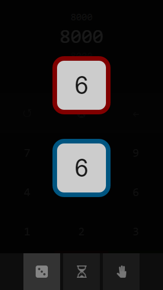
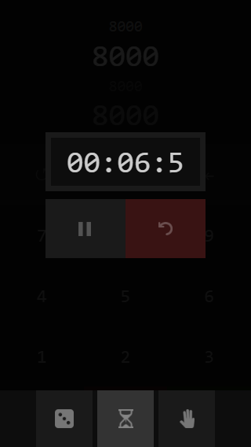
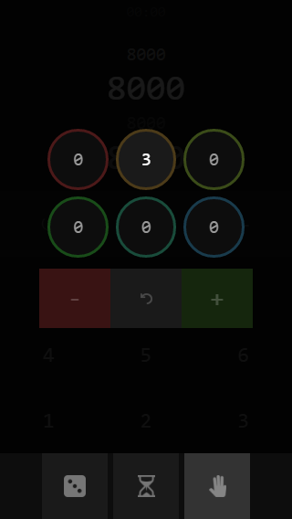

import "./ygolp.css";

Screenshots from my retired mobile app, YGOLP (a.k.a. Yu-Gi-Oh life point counter), one of the earliest projects of my development career.

## Screenshots
{/*  */}
- 
- 

{/*  */}
- ")

{/*  */}
- ")
- 

{/*  */}
- 
- 