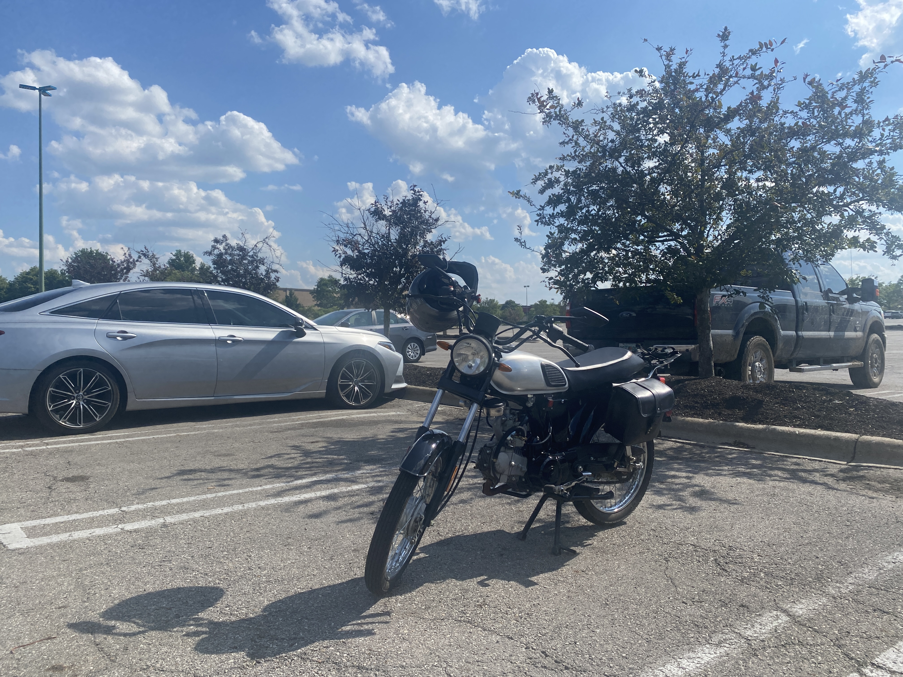
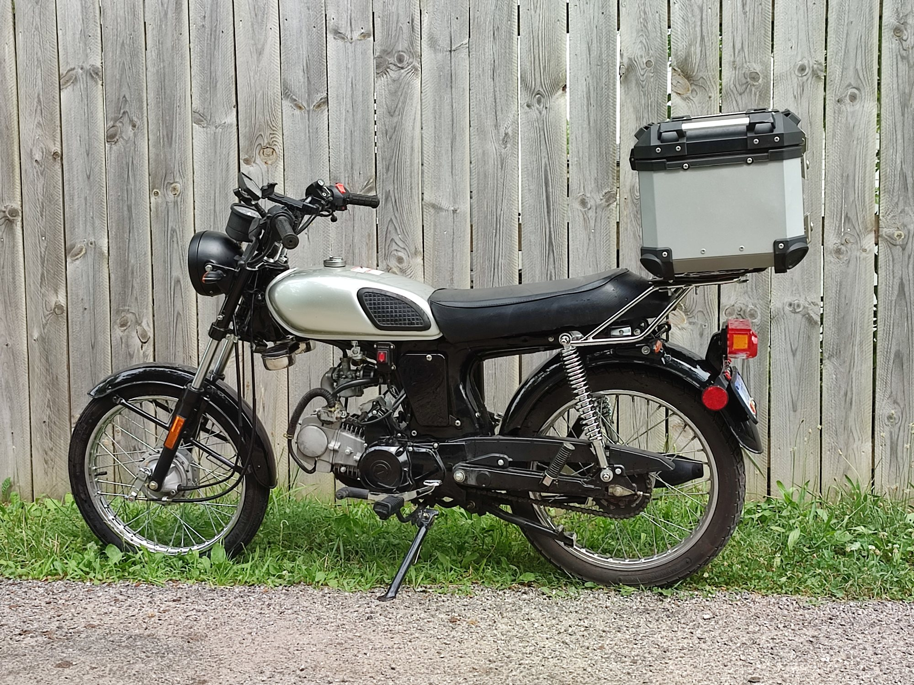
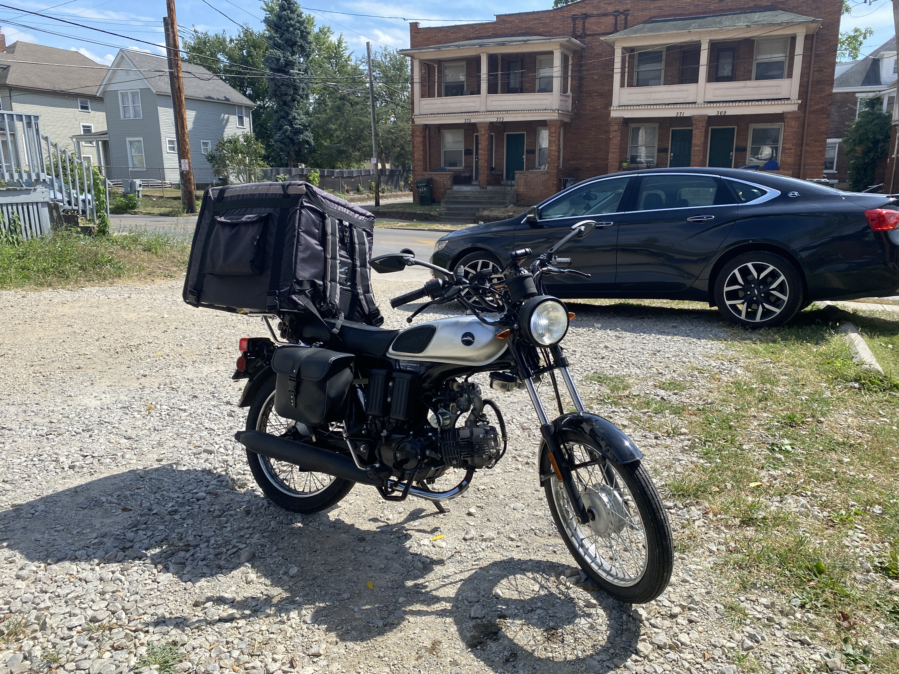

import LinkCallout from "../../../components/LinkCallout.astro";

import "./BD125-2.css"

## An affordable motorcycle for urban commuting and delivery

I hope to never come across as a "motorcycle guy" or any kind of motorhead whatsoever… As much as I despise the road, there is a certain sense of adventure and pride that comes with building and maintaining your own vehicle.

I will write a few words about the bike I use, purely because people ask about it all the time and it'll be convenient to have a place to point to for some basic information.

### The Baodiao 125cc in a nutshell

I drive a customized BD125-2, a Chinese 125cc motorcycle manufactured by Baodiao. 200-lbs wet weight, 100 miles per gallon[^mpg], 4-speed, kick-startable, easily hangs with traffic everywhere except the highway, and can be legally parked on sidewalks in most places. It's good for at least 45mph in all conditions, usually more like 50–55 in warm weather, even with the drag from a large delivery bag.[^top-speed] 

[^mpg]: Not as efficient as Honda, but still leaps and bounds ahead of most vehicles on the road.
[^top-speed]: My record is over 62mph on the highway with the throttle pinned.

It's known as a *cafe cruiser*, modeled after 1960s mopeds, broadly-speaking.[^50cc][^cafe-cruiser] A lot of imported Chinese bikes are clones of older Honda models (seemingly because they rip off the expired patents) which is good news for parts availability. This frame is practically identical to the Honda CL50 and CL70 from the late 1960s onward and is compatible with their engines, tanks, seats, and racks with minimal alteration.[^JH70]

[^50cc]: They used 2-stroke 50cc engines in that era, and contrary to what you might assume, this is *not* twice the power… it's a greater displacement volume at *lower* RPM which is why 4-stroke engines are so much quieter (and most car engines even more so, despite their size). In actuality, engine displacement tells you very little about the output horsepower. Modern bikes with the Lifan 125 are generally on par with the 50cc motorcycles of the day.
[^cafe-cruiser]: Not to be confused with a *cafe racer*. I won't go into what defines these terms, but the point is it's designed for an urban environment, as if to go literally from one cafe to another.
[^JH70]: The JH70 is a similar clone model manufactured using this same frame, only marketed in Asian countries.

This bike is an excellent platform for building a *new* classic Honda or as an educational first motorcycle to wrench on.[^build] This post won't be covering all the specific problems I've encountered since receiving mine, but suffice to say it's a mistake to think of these cheap imports as anything but a prefab, or a "mechanic's special" as they call it, to be reworked from the ground up.

[^build]: Think of it as an alternative to buying a used frame and having it painted, assembled, DOT-inspected, VIN-plated, and re-titled. If such a thing is even possible where you live, it is likely not cost effective compared to modifying a cheap pre-built motorcycle.

### Legality & Safety

The BD125-2 is built to international standards, made federally-compliant in the US, and requires a regular motorcycle license. It's registerable in almost every state and easy to learn as a new rider. (I aced my skill test on it after a couple months of practice.) Insurance is in the ballpark of $100 USD per year.

As far as keeping an imported Chinese motorcycle in safe working order… If you're not comfortable taking your vehicle apart down to every last nut, bolt, seal, and ball bearing and doing major rebuilds with aftermarket parts, better to go with a better-supported name brand instead.

### Where to get the BD125-2

The model we got in North America is manufactured by Baodiao, imported formerly by a company called Boom and now by X-Pro USA, marketed as the <a rel="external" href="https://xprousa.com/products/x-pro-125cc-cafe-cruiser-racer-gas-bike-bicycle-style-motorcycle-with-manual-transmission-electric-kick-start?variant=41863003504800">X-Pro X25</a>. They seem to come in one or two shipments per year and sell out almost immediately. They might turn up on <a rel="external" href="https://www.amazon.com/dp/B09SBZQW2B">Amazon</a>, <a rel="external" href="https://www.walmart.com/ip/X-Pro-Brand-New-X25-125cc-Cafe-Cruiser-Racer-Gas-Bike-Bicycle-Style-Motorcycle-Bike/3765260610">Walmart</a>, <a rel="external" href="https://www.powersportsmax.com/product_info.php/products_id/22422">PowersportsMax</a>, or <a rel="external" href="https://www.venommotorsportsusa.com/">Venom Motorsports</a>. Check back with those sellers or on Facebook Marketplace if you don't see any available.

As a street-legal motorcycle it comes with an MCO which you trade in at your local title office.

### Replacement Parts and Accessories

The upside to the appropriation of these old Honda blueprints is there are tons of compatible parts both from the used Honda market and from wholesale manufacturers in China, Vietnam, and Thailand. These parts can usually be had for cheap compared to OEM-spec stuff from major brands. They're also similar spec to common Chinese dirt bikes available all around the world which makes it a breeze finding replacement parts on Amazon and the like. Everything on the bike can be fixed at home or even roadside. The mechanic center-stand supplants the need for a jack.

This was just a basic introduction to the BD125-2. Eventually I will post a full rundown of the bike with parts, tips, solutions to out-of-the-box issues, and how to survive commuting on one as your primary vehicle.

You can see some of my ride videos on this [YouTube playlist](https://www.youtube.com/playlist?list=PLFzeAjBxAWziJpKxbPvxAWqBgetJd8SgN).

<aside class="callout-container">
	<LinkCallout id="bd125-2" />
	<LinkCallout id="bike-channel" />
</aside>

### Other Small Affordable Motorcycles
- <a rel="external" href="https://www.venommotorsportsusa.com/products/sportster-250cc-chopper">Venom Sportster</a> 250cc cafe racer
- <a rel="external" href="https://www.amazon.com/dp/B082WPVVDZ">Boom Vader / X-Pro Vader</a> 125cc, Honda Grom clone
- <a rel="external" href="https://www.icebearatv.com/product/PBZ125-2P">Icebear Champion</a> 125cc, classic Honda Trail clone (Automatic)
- Amigo Rocky 125cc, classic Honda Trail clone (Manual)

### Other Anticipated Motorcycles
- CSC Wolf 125, modern Honda Trail clone (being re-certified as of mid 2024 due to patent infringement)