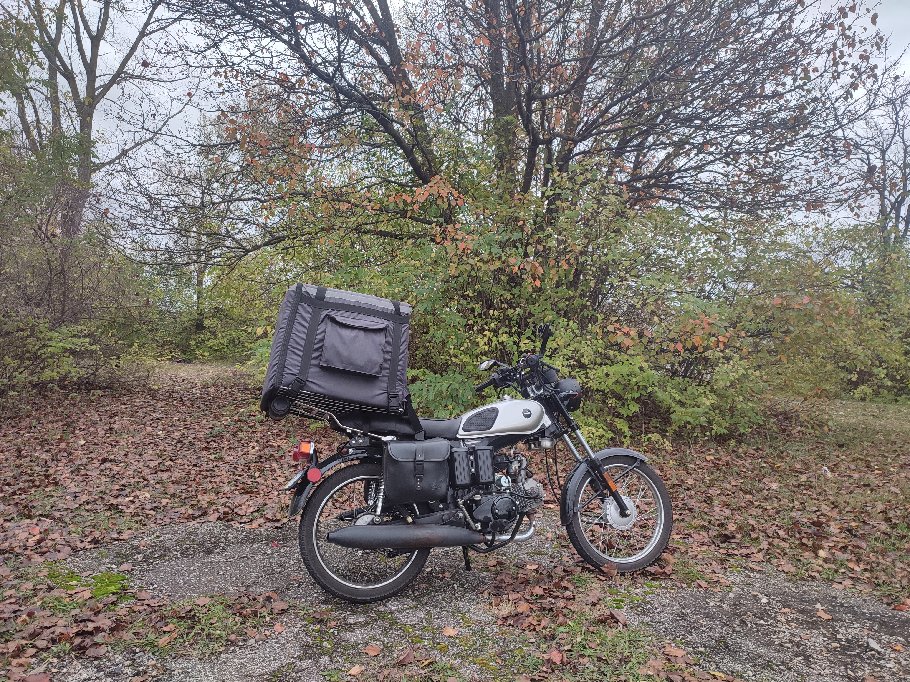
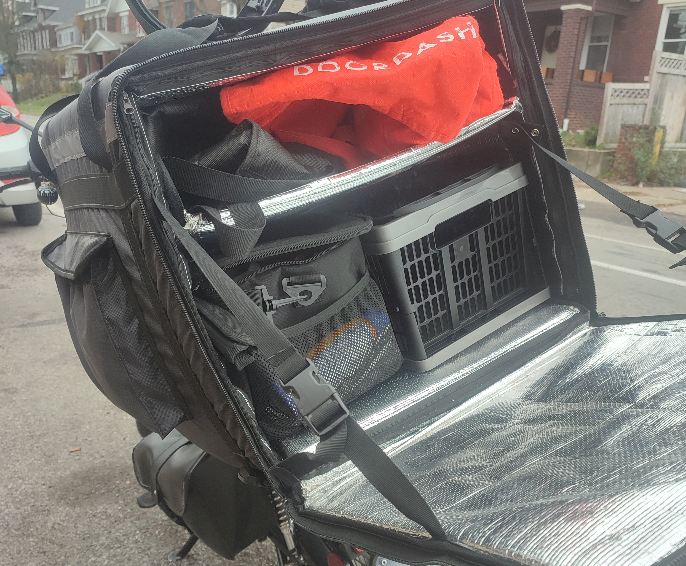
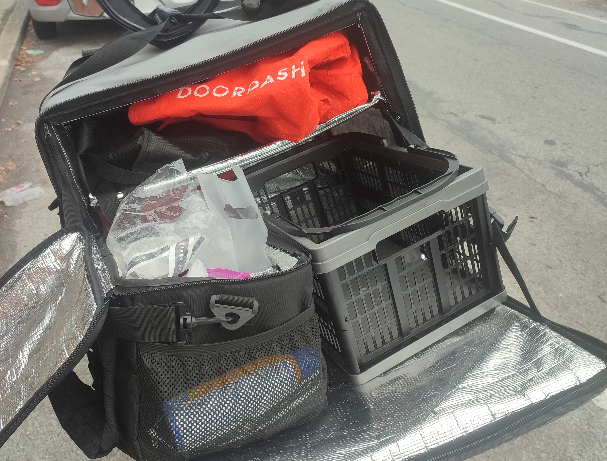
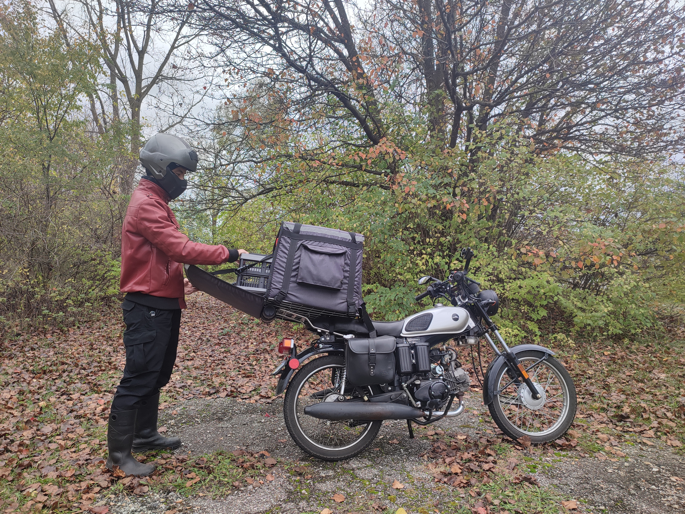

## Low-Down On Delivery Biking

Food delivery is a straightforward and relatively stress-free way of being your own boss and supplementing your income with flexible scheduling and minimal physical strain. I'm lucky enough to own my home near the university district of Columbus, Ohio, where you can make around $15–30 dollars per hour just driving food around.[^pay] As of 2024 I can easily afford all my bills with just a few hours of work each day, leaving me plenty of time to take care of my home and practice my other hobbies.

Many are not aware that the majority of popular delivery platforms including restaurants and grocers that offer delivery do not actually employ drivers… instead they utilize independent contractors (or partner with the aforementioned apps) who work case by case on their own schedules. The specific platform I use is not necessarily important but it's one that—unlike most of their competitors—specifically allows the use of motorcycles. In addition to your auto insurance[^commercial-insurance] they also offer some supplemental coverage options for a few dollars per week.

I commuted on a variety of bicycles and e-bikes for many years and have since settled on a 125cc motorcycle for most purposes, which among bikes could be seen as the minimum-viable product for American cities to avoid being harassed by drivers while still having an incredibly small environmental footprint. (See my blog post for details on
[the bike I use](/posts/bd125-2).)
Insurance and fuel are dirt cheap. Other advantages are the ease of parking and a great deal of flexibility in negotiating parked vehicles and other road blockages. (I happen to live in an area where outright lane-splitting is forbidden but they do allow some leeway for stationary obstructions.) In other words, it's nigh impossible to get stuck anywhere.

Bikes of all kinds also handle better than cars on dirt, steel plates, rail crossings, speed bumps, sharp corners, and pretty much everything else other than deep snow and ice. And above all—not meaning to push my agenda too strongly—they are far less threatening and perilous to everyone around you. In short, there are a lot of advantages to this sort of vehicle but it does take certain bold and free lifestyle, not to mention the importance of understanding the physics involved at all stages, not only of your own vehicle but everyone else's as well.

## Equipment & Strategy

Besides basic moto gear and clothing, very little specialized equipment is actually necessary for food delivery. You can get by with any sort of bag or trunk but I will outline a few things that can really make the job go smoothly.

I have detailed
[wet & cold weather gear](/posts/rain-commuting)
in another blog post. In addition to the accoutrements covered in that article it's also helpful to have a [touch screen stylus](https://www.amazon.com/dp/B09JYNB5ZV) accessible while wearing gloves.[^gloves-screen]
For sunny weather, be aware that many hours of direct UV will quickly destroy dark clothing, so prefer light-colored synthetic fabrics (and wear sunscreen).[^sun-bleaching]

The logistics of carrying your orders are fairly simple. 99% of deliveries are just one or two meals, often with no drink. You can occasionally get prescription medication or alcohol, which involve a few more administrative steps but are equally simple to deliver. I opt out of shopping orders but you can still get things like large catering boxes, bags of pet food, cases of canned drinks, and party supplies which are inconvenient but manageable with cargo straps, provided you have a rack to put them on.

An oversized delivery backpack is plenty for the vast majority of cases. I use a
[20" rigid insulated bag](https://www.amazon.com/dp/B07WWLCMHV), mounted semi-permanently to the bike but easily removed and carried on your back to accommodate any of the above mentioned cargo that doesn't fit inside. (*Counter-leaning* is your friend with either setup.) It's rare to get any more than two orders stacked together but you do get doubles quite often, so I bring two regular food bags.

A separate
[insulated carrier for drinks](https://www.amazon.com/dp/B092LWQCZW)
is a must-have. I pair it with a collapsible basket, sized to fill the remaining space and keep anything from sliding around. Most drinks are sealed pretty well by the restaurant and can be placed directly in the carrier with no spillage. Others need to be secured with your own tape or
[tamper seals](https://www.amazon.com/dp/B094JDVFWX),
and in rare cases, bagged individually in
[single-use plastic drink bags](https://www.amazon.com/gp/product/B0B6FJ3B4W).
I worried a lot about the drinks when I first started, but with the carrier and a bit of padding on top along with those extra measures, I can drive normally and never worry about spillage. Even leaning the bike is not an issue with lids taped down.

In my area there is very little time spent waiting for jobs. If a delivery takes you far out of your zone, you may have to drive for some time back to a hotspot… but if you finish a job anywhere near your starting zone, there is likely to be another one lined up or coming imminently. Because there is so little downtime I have found it more profitable to use the hourly pay model rather than per-order, and accept 100% of orders (which I understand is not the case in many other markets). This way you tend to get longer trips that other drivers have already declined, e.g. 5–10 mile no-tip jobs which would be worth just over $2 to most drivers, whereas I get paid more than $10 on the hourly model.[^long-deliveries]

My general routine is to go up to the edge of my preferred zone around lunch time to sign in, then start driving toward campus. The first order usually shows up within a couple of minutes—typically starting on High Street—and from there I might end up anywhere in Columbus or surrounding cities. With luck, one of my later jobs will take me close to home for the end of my shift.

**Useful motorcycle mods**:
- **Keyless ignition** — I add a
[wireless relay](https://www.amazon.com/dp/B071WM1YGS)
to my ignition switch for fast parking without fiddling with keys. I simply flip the battery switch to lock and press the fob to unlock. The traditional key still works and for longer periods I mechanically lock the steerer.
- **GPS tracker** — In addition to AirTags I wire in a
[SinoTrack ST-907L](https://www.amazon.com/dp/B089W9RR4M)
proper hidden tracker. Costs next to nothing with a [Things Mobile](https://www.thingsmobile.com) pay-per-use SIM.

**Other helpful supplies for delivery work**:
- **Spare drawstring mesh bag** — takes very little space to pack, extremely valuable for unexpected overflow items, can be worn on your front or back
- **Spare straws, utensils, and napkins** — occasionally forgotten by the restaurant or requested by the customer, stores well inside a sport water bottle or moto tool tube
- **Shipping tape** — in case of ripped or soggy paper bags or for emergency securing of cargo
- **Paper towels** — for greasy bags and spills
- **Hand sanitizer** — We are serving food, after all.
- **Markers** — for distinguishing unlabelled orders in a batch or writing notes
- **Headset** —
[bluetooth helmet speaker](https://www.amazon.com/dp/B0BRB6VKXD)
for navigation and calls
- **Action camera / dashcam** — I use the
[Insta360 GO 3S](https://www.amazon.com/dp/B0D3WLV9Q1).
(You can see the result on my
[YouTube Channel](https://www.youtube.com/@turtlemaybikes).)

[^pay]: That's significantly more than any of my previous retail jobs where I was working multiple departments, walking more than 15 miles every day, and generally seen as an unskilled beast of burden.

[^commercial-insurance]: Sadly, in the United States there's no such thing as commercial insurance for motorcycles, so in the event of an accident it's very important to not say or do anything to confuse your insurance company or give them a reason to rule against you just because you're carrying someone's food. This is not the same as ridesharing and does not warrant the same liability restrictions.

[^gloves-screen]: I usually keep a touch stylus tied to my glove, fastened in a way that can break away in an emergency. One or two twists of safety wire at one end of a cord can hold it while still allowing you to pull away with force. Some DIY velcro or snap buttons could serve just as well. More recently I use a slightly more advanced setup involving a
[bluetooth programmable keypad](https://www.amazon.com/dp/product/B0BDRPQLW1)
and mobile accessibility settings for controlling my phone with gloves on.

[^sun-bleaching]: A pair of black pants ridden in the height of summer will become thoroughly bleached in a matter of days, starting at the knees. Once degraded, not even a strong dye can restore the color. I noticed the same effect while working as a department store parking lot attendant.

[^long-deliveries]: I have come to prefer these longer drives rather than visiting many restaurants in a small area. There is an added risk working with these customers who are more likely to dish out bad ratings (if not outright abuse). However, these occurrences are surprisingly rare. I've found it's primarily restaurant workers rather than customers who are senselessly nasty to drivers, which completely defies my expectations coming from the retail industry.