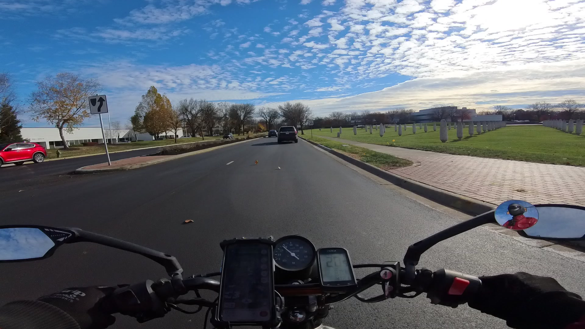
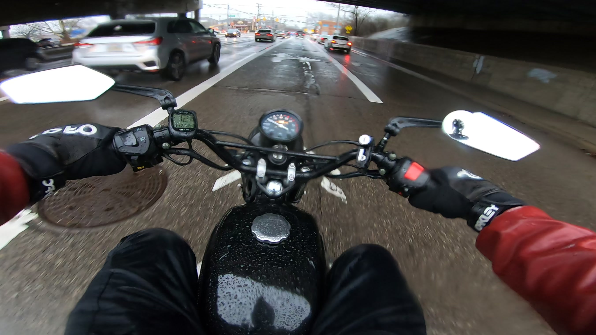

Riding a motorcycle year-round, my coworkers are often astonished at the conditions I subject myself to in my efforts to avoid driving. I joke that there's this great new invention for protecting yourself from the outdoors… it's called *clothing*. And truthfully there's not much more to it than that. However there is an important distinction to be made when choosing wet weather gear for cycling and motorcycling.

## Rainy Weather

Searching online markets for rain gear yields a lot of nylon and other synthetic fabrics which are versatile and effective in the short term for foot travel (especially when paired with an umbrella) but quickly fall short once you start turning up the velocity and wind, or spend any length of time in a storm. The bottom line on these materials is this:

*No textile is waterproof*.

In terms of flexible materials, only plastic is impenetrable to water, e.g. **polyurethane coating**. such as faux leather (a.k.a. PU leather), which is easy enough to find in a jacket. But when it comes to pants, even motorcycle-specific rain suits tends to prioritize breathable nylon or polyester layers which reduce sweat but will not keep you dry in the long term.

The rationale of breathability in a rain suit has never made sense to me. As far as commuting goes, rather than wearing heavy gear for such an extended period that sweat becomes an issue, you probably only need to be impenetrable to water for a short time before either removing your PU layers or changing into another outfit. However the cycling and motorcycling markets tend not to agree with this. So for a truly waterproof gear we need to look to other industries.

- **Waterproof Pants** — Commercial fishing bibs are excellent for keeping dry. I recommend the 
[Grundens Neptune](https://grundens.com/products/neptune-509-bib-pant) 
lightweight PU overalls which can layer over your regular pants. Alternatively, with shorts underneath they are also comfortable for working in warm weather. [^swim-trunks]

- **Boots & Gloves** — For your feet and hands, use tall [PVC rain boots](https://www.amazon.com/gp/product/B003Y2VBQI) with a good tread and either waterproof work gloves or snow gloves ([see below](#winter-mitts)).

- **Waterproof Top** —
[Faux leather jackets](https://www.amazon.com/gp/product/B09ZHGH7BG) over a couple of core layers work well for autumn weather. For lighter duty, consider short-sleeve or long-sleeve nylon fishing shirts
[\[1\]](https://www.amazon.com/gp/product/B0CLQVJJYZ)
[\[2\]](https://www.amazon.com/gp/product/B08GK4QFDH)
(bearing in mind my previous caution against waterproof fabrics). Many of these have a mesh inner layer remarkably similar in construction to swim trunks. [^swim-trunks]

- **Helmet** — Pretty much any full-face moto helmet is a solid rain and snow barrier. I'm a huge fan of the DOT-certified
[1Storm HKY861](https://1stormhelmet.com/products/1storm-motorcycle-full-face-helmet-open-face-knight-classical-detachable-face-mask-hky861) with removable mouth guard.
For something lighter, a ski helmet and face shield offers excellent protection ([see below](#face-shield)).

## Freezing Weather

In terms of gear, the answer to winter riding is even simpler than the rainy season. For cold-weather riding we can simply look to the skiing and snowboarding market, which thoroughly covers helmets, goggles & face shields, pants, gloves, and boots.

- **Three-finger winter mitts**
[\[1\]](https://www.amazon.com/gp/product/B07FQWKM57)
[\[2\]](https://www.amazon.com/gp/product/B08FD28LRB) —
For both rain and cold weather, significantly more comfortable and effective than a typical glove.

- **Full-face goggles**
[\[1\]](https://www.amazon.com/gp/product/B082DLX5PR)
[\[2\]](https://www.amazon.com/gp/product/B06Y5ZXYDW) —
Paired with a ski helmet to stave off the freezing wind.

- **Headwear** — For situations such as paved trail cycling where a ski helmet might be too bulky, a [trooper hat](https://en.wikipedia.org/wiki/Ushanka#Similar_hats) with or without added earmuffs is quite comfortable.

The rest is fairly self-explanatory. Use tall snow boots and add faux-fur or electric warmers such as a heated vest or in-soles to your comfort level. If you have time to get a pot boiling, a
[hot water bottle](https://en.wikipedia.org/wiki/Hot_water_bottle)
worn beneath your coat against your back or chest is extremely helpful in sub-zero temperatures.

At higher speeds the most important factor is shielding yourself from the wind with hard-shell materials. Provided you have a full wind-breaking layer, let your circulatory system work for you and layer up your core first before going overboard on the extremities.

## Other Gear

- **Tires** — Regular street treaded tires are perfectly fine for wet pavement with minimal technical adjustment. Obviously don't ride slicks or worn-out treads and don't use knobbies on the road unless they are studded for snow and ice. [Schwalbe Marathon Winters](https://www.schwalbetires.com/Marathon-Winter-Plus-11100597.01) are a tried-and-true studded tire for bicycles. For the moto world, you have to make your own using a dual-sport such as the [Shinko 244](https://shinkotireusa.com/product/244-series-dual-sport-tire/211927) and
short [screw-in studs](https://www.amazon.com/gp/product/B078JJ6J4S) around 9mm in length.

- **Cargo** — For keeping your spare clothes, shoes, and supplies dry, you can use PU bags or a Pelican-style hard case.
[Rok straps](https://rokstraps.com/)
are my go-to for securing any load.

[^swim-trunks]: For mid-summer rains I've also been known to slum it in just surf shorts, fishing shirt, and crocs. I like to think of it as the "Boardwalk Tuxedo".