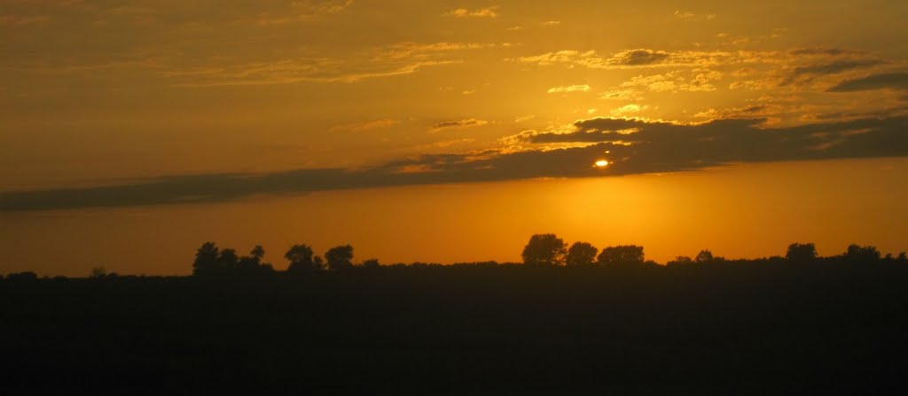
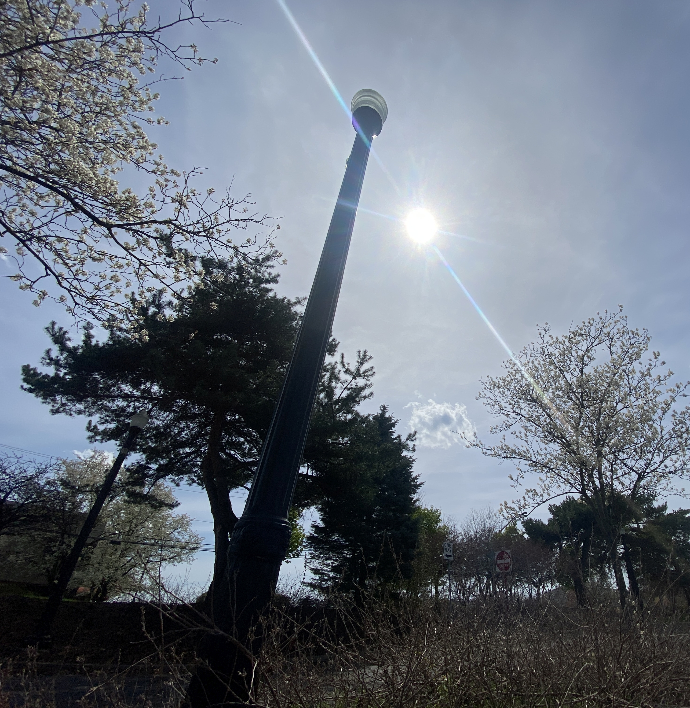
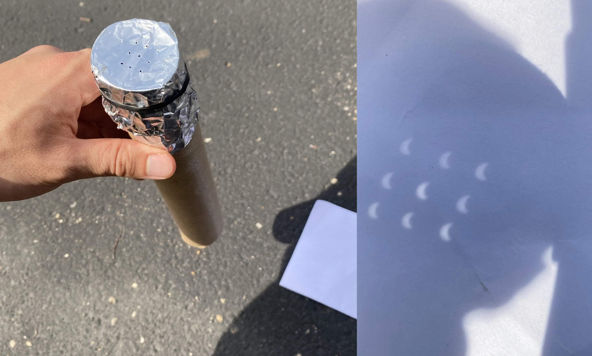
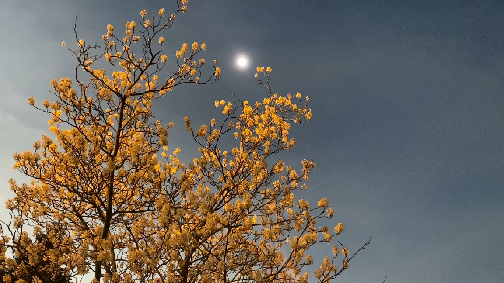

import LinkCallout from "../../../components/LinkCallout.astro";

import "./solar-eclipse.css";

Some of my formative experiences were my father's annual drives from Savannah to my great-aunt's house in Hinesville for Thanksgiving—back when a mere 45 minutes in the car was an immeasurable aeon… The evening's ride home would take us through 40 miles of rural roads under a dazzling night sky boasting the familiar planets, constellations, and even the delicate dusting of the Milky Way.

Being in a major city, all my sky-gazing experiences since then have understandably fallen short… Other than the International Space Station sailing by occasionally, one can scarcely see as much as a lone star in the sky.

	However, early this year I was lucky enough to be near the path of the total solar eclipse through North America—on my late father's birthday, aptly enough—which I was able to catch despite the cloudy forecast. A rare occasion for a short vlog (or as near to one as I'm ever inclined) which I've [posted to YouTube](https://www.youtube.com/watch?v=5UgVK_r6GJU).
	

		<LinkCallout id="eclipse-video" />
	

I threw together my eclipse projector that morning and took my bike 15 miles up to one of my usual spots near Otterbein University in Westerville, checking the moon's progress along the way with anticipation. You can't look directly through the penumbra but the partially darkening ground leading up to the totality creates an eerie, unearthly feeling all around.

After arriving at Everal Homestead I started a [several-minute time-lapse](https://www.youtube.com/shorts/9MIZ72Cdc24) while I watched nearby.

Compact cameras unfortunately aren't made for this sort of thing but I was very pleased to witness the sun's corona peppered by fiery beads peeking through the contours of the moon's surface—likely the last opportunity in my lifetime, discounting a trip to Canada or Florida in 20 years.

